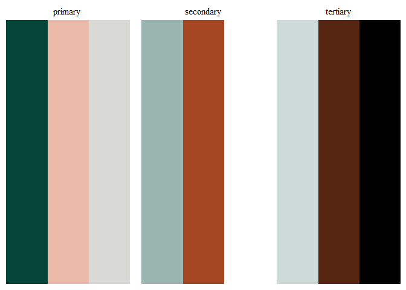
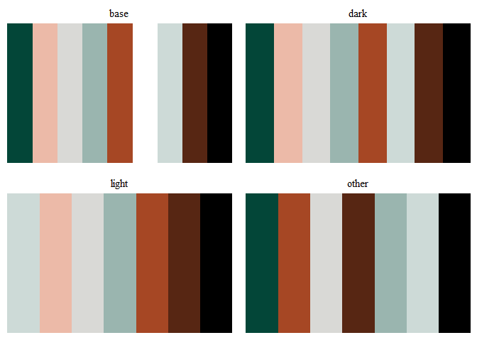
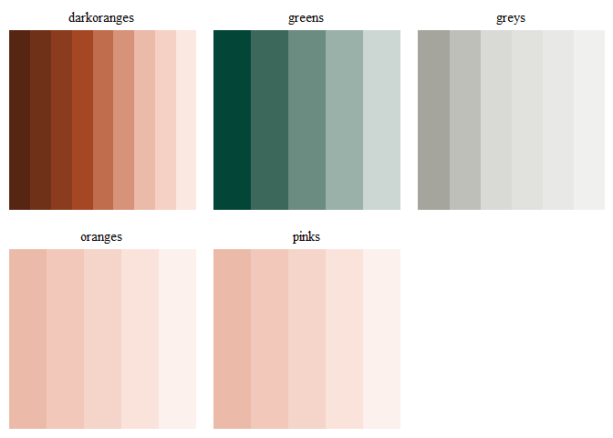

<!-- README.md is generated from README.Rmd. Please edit that file -->

# cubepalettes

<!-- badges: start -->
<!-- badges: end -->

Colour and palettes as defined in the Cube Group Brand guidelines.

The main purpose of cubepalette is to enable Cube Group staff to use the
colours and palettes defined in the brand guidelines within R.

cubepalette was created with the **palettes** package, which provides a
comprehensive library for colour vectors and colour palettes using a new
family of colour classes (`palettes_colour`, and `palettes_palette`)
that always print as hex codes with colour previews. Colour palette
packages created with palettes have access to the following
capabilities, all without requiring you to write any code: formatting,
casting and coercion, extraction and updating of components, plotting,
colour mixing arithmetic, and colour interpolation.

See the following vignettes to learn how to use cubepaellets with other
packages:

- [Using palettes with
  ggplot2](https://mccarthy-m-g.github.io/palettes/articles/ggplot2.html)
- [Using palettes with
  gt](https://mccarthy-m-g.github.io/palettes/articles/gt.html)
- [Using palettes with
  biscale](https://mccarthy-m-g.github.io/palettes/articles/biscale.html)
- [Compatibility with other colour
  packages](https://mccarthy-m-g.github.io/palettes/articles/compatibility.html)

## Included Colours

Cube Group’s colour palette uses modern and distinctive tones to convey
corporate warmth.

### Cube Green



`cube.green` is used in majority, bringing maturity and a seriousness
when needed.

### Cube Pink


`cube.pink` adds warmth, livening up layouts and highlighting key
information.

### Cube Grey


`cube.grey` is used as a neutral background colour.

### Cube Black and Cube White

`cube.black` and `cube.white` are convenience names for `black` and
`white` that allow for consistent syntax when using cubepalette.

## Installation

You can install the development version of cubepalette from
[GitHub](https://github.com/) with:

``` r
# install.packages("devtools")
devtools::install_github("zerogetsamgow/cubepalette")
```

## Usage

``` r
library(cubepalette)
#> Loading required package: palettes
```

cubepalette comes with a set of 4 discrete colour palettes, and 3
sequential colour palettes, which can be accessed from the following R
objects:

- `cube_palettes_discrete` for discrete palettes
- `cube_palettes_tints` for sequential palettes
- `cube_palettes` for all palettes

### Discrete

Discrete palettes for use with various backgrounds are available.
`dark`, `light` and `other` have been compiled to work on backgrounds
composed of colours from the Cube Group brand guideline.

``` r
plot(cube_palettes_discrete)
```



### Tints

For long form documents infographics and charts, tints from the Cube
Group colour palette can be used in 20 per cent increments.
`cube_palettes_tints` is populated with compliant `greens`, `pinks` and
`greys`.

``` r
plot(cube_palettes_tints)
```



Palettes can be subset using `[`, `[[`, and `$`.

- To extract one or more palettes use `[`:

  ``` r
  cube_palettes_tints[c("greens", "greys")]
  ```

  

- To extract a single palette as a colour vector use `[[` or `$`:

  ``` r
  cube_palettes_tints[["pinks"]]
  ```

  

  ``` r
  cube_palettes_tints$pinks
  ```

  

- To get names of palettes use `names()`:

  ``` r
  names(cube_palettes_tints)
  #> [1] "greens" "pinks"  "greys"
  ```

## Documentation

See also documentation for the palettes package at
[`https://mccarthy-m-g.github.io/palettes/`](https://mccarthy-m-g.github.io/palettes/reference/index.html)
or in the installed package: `help(package = "palettes")`.
